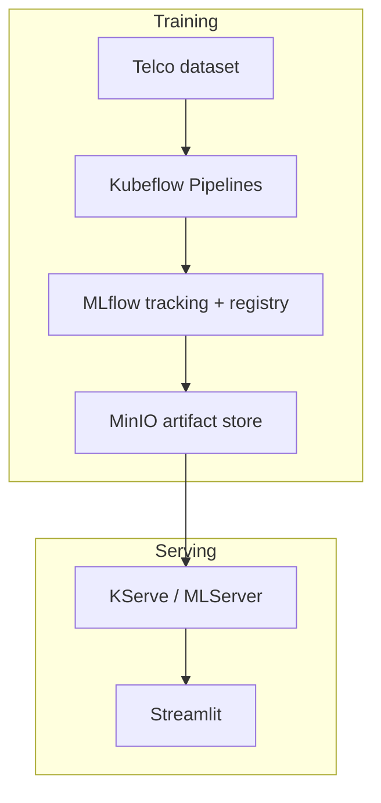
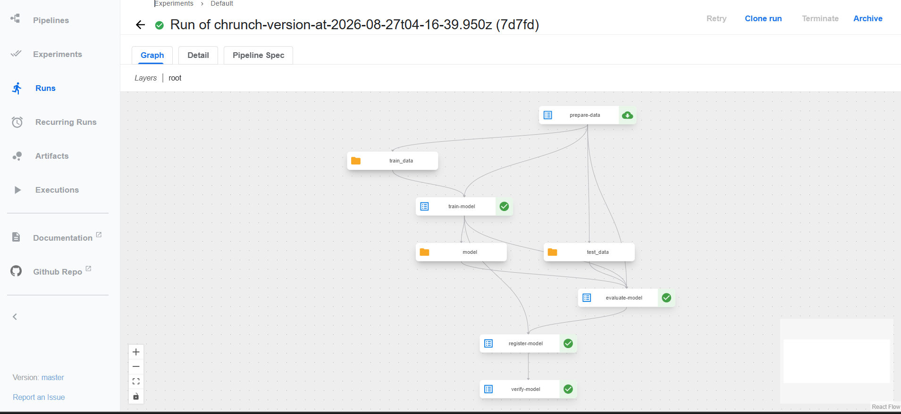
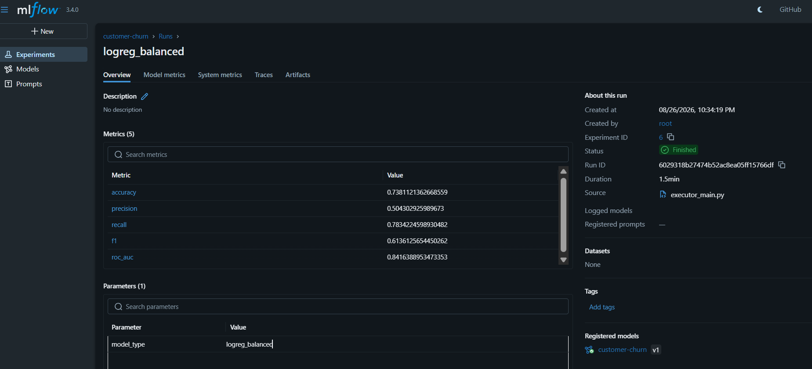
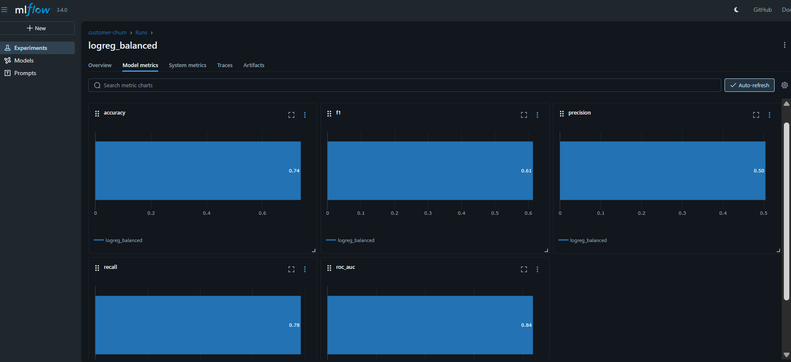
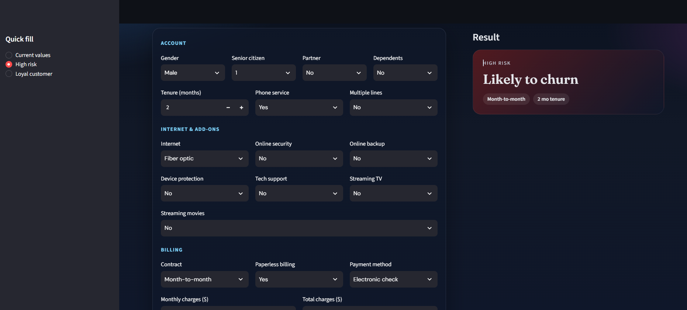
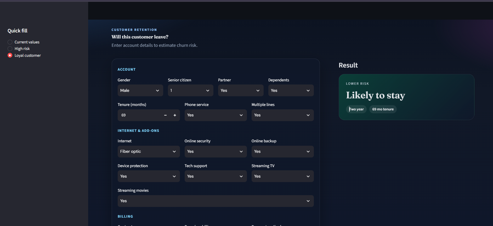

# Customer Churn MLOps

End-to-end lab: train a telco churn model on the cluster, track it in MLflow, serve it with KServe, and score customers from a Streamlit UI.

The UI does **not** train a model or load a `.pkl`. It only calls the inference API.

Dataset: https://raw.githubusercontent.com/IBM/telco-customer-churn-on-icp4d/master/data/Telco-Customer-Churn.csv

---

## Problem statement

Telecom operators lose revenue when customers cancel service (**churn**). Retention teams need an early signal: *given this account, is the customer likely to leave?*

This project treats that as **binary classification**:

| Label | Meaning |
| --- | --- |
| `Churn = Yes` → class `1` | Customer left |
| `Churn = No` → class `0` | Customer stayed |

Features include tenure, contract type, internet add-ons, billing method, and charges (IBM Telco Customer Churn dataset).

A local Logistic Regression baseline is enough to learn the **platform**. Experiment comparison (balanced LR vs Random Forest) is stored in MLflow so “which model is better?” is not lost in terminal history.

---

## Use case

1. A data scientist (or scheduled pipeline) retrains on the latest churn table.
2. Metrics and the model artifact are logged to **MLflow**; a version is **registered**.
3. An approved artifact is deployed as an **HTTP scoring service** (**KServe**).
4. A retention agent (or demo) opens **Streamlit**, enters customer details, and sees **likely to stay** vs **likely to churn**.

```text
Training (Kubeflow + MLflow)     Serving (KServe + Streamlit)
────────────────────────────     ────────────────────────────
Dataset → pipeline → registry    Inference API → human UI
```

---

## Architecture



---

## Tools

| Tool | Role in this project |
| --- | --- |
| **Python, pandas, scikit-learn** | Clean data, `ColumnTransformer` + Logistic Regression (and RF locally) |
| **MLflow** | Experiments, params, metrics, model registry |
| **MinIO** | S3-compatible store for MLflow artifacts (`s3://modelpath/...`) |
| **Kubeflow Pipelines** | Orchestrate prepare → train → evaluate → register → verify |
| **KServe** + **MLServer** | Deploy the MLflow sklearn model as HTTP |
| **Streamlit** | Thin client for a retention-style form |
| **Kubernetes** | Runs pipelines, MLflow, MinIO, and the InferenceService |

---

## Repository layout 

```text
customerchurn/
├── data/telco_churn.csv
├── src/
│   ├── pipeline.py
│   ├── pipeline.yaml
|   ├── kserve.yaml
├── app/streamlit_app.py
├── screenshots/
├── requirements.txt
└── README.md
```

Cluster assets (on the VM) typically include `pipeline.py`, KServe YAML, and a NodePort Service for the UI.

---

## How to run 

**Streamlit** (API URL via env only; not shown in the UI)

```bash
export INFERENCE_URL=http://<node-ip>:<nodeport>/invocations
streamlit run app/streamlit_app.py
```

---

### Kubeflow pipeline

Successful run: prepare → train → evaluate → register → verify.



### MLflow

Experiment `customer-churn`, metrics, and registered model.






### Streamlit

**Likely to stay** / **Likely to churn** result.





